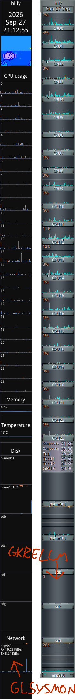

glsysmon
========

A dockable system monitor which isn't gkrellm but it probably strangely familiar to anyone who's used gkrellm.

What?
-----

glsysmon is a system monitor for Linux using either X11 or Wayland which docks
at the side of the screen and shows blinkenlights about what your system is
doing. It's supposed to be similar enough to gkrellm to be a drop-in
replacement.

All the various monitors and displays supported are shown to the right
(alongside gkrellm, for comparison). Update speed, monitor order, which monitors
are shown, which disks, network interfaces,temperature sensors etc are all
configurable via the GUI (right click to open). It has hidpi support. And a
built-in port of [BubbleFishyMon](https://github.com/JNRowe/bfm)!

It's in C++ and implemented using imgui and implot.

Why?
----

I've been using gkrellm for so many years that I feel deeply uncomfortable using
a computer which doesn't have a decent set of graphs at the edge of my screen.
Unfortunately, gkrellm's days are numbered --- it's using a very deprecated
version of Gtk, and X11 struts (which it uses for docking) aren't and won't be
supported on Wayland. So I made my own.

AI disclosure
-------------

Most of the code here is machine-written, but it's not vibe coded; I
micromanaged the machine, telling it precisely what code to write and then I
would complain until it got it right. No part of the design was AI generated.

How?
----

It's known to build on Ubuntu, Debian and Fedora. You need these libraries:

- libgumbo-dev
- liblitehtml-dev
- libmagicenum-dev
- libsdl3-dev
- libstb-dev
- libtomlplusplus-dev
- libvulkan-dev
- libwayland-dev
- libx11-dev
- wayland-protocols
- xvfb

And then `make` with as much `-j` as you like.

To use: right-click on the dock to show the configuration window. If you want to
override the X11/Wayland detection, use `--dock=x11` or `--dock=wayland`; you
can also do `--dock=fallback` to disable all the docking stuff and use a normal
X11 window (good for exotic window managers like notion).

License
-------

Everything in `src` is © 2026 David Given distributable under the terms of the GPL2. See [COPYING](COPYING) for the full license text.

The `dep` directory contains third-party code which is vendored into the final binary:

- `imgui` --- the `docking` branch of [Dear Imgui](https://github.com/ocornut/imgui); MIT licensed.
- `implot` --- the [implot](https://github.com/epezent/implot) immediate-mode plotting library; MIT licensed.
- `imhtml` --- the [imhtml](https://github.com/BigJk/ImHTML) HTML-rendering library, heavily modified; MIT licensed.
- `codicons` --- [GitHub's icon library](https://github.com/microsoft/vscode-codicons); Creative Commons Attribution 4.0 licensed.
- `bfm` --- [BubbleFishyMon](https://github.com/JNRowe/bfm); GPL2 licensed.

For the full license text, look in each subdirectory.

The duck is just a duck.
------------------------